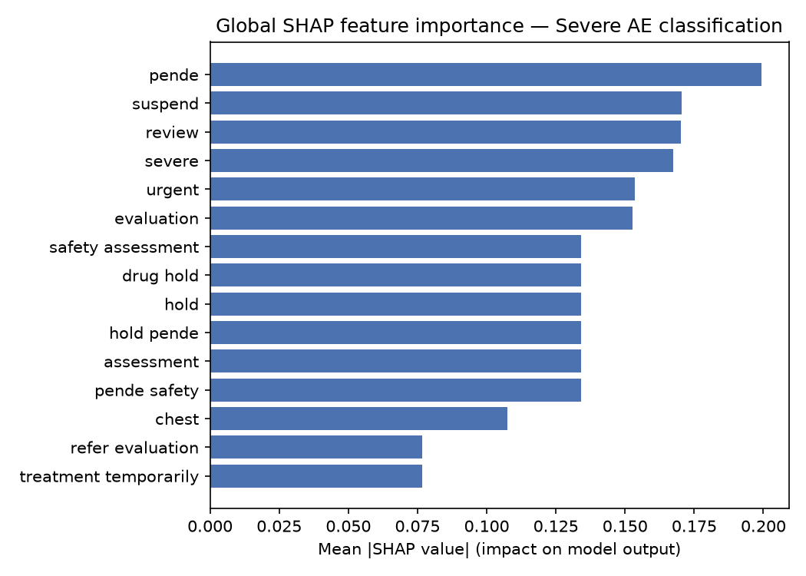
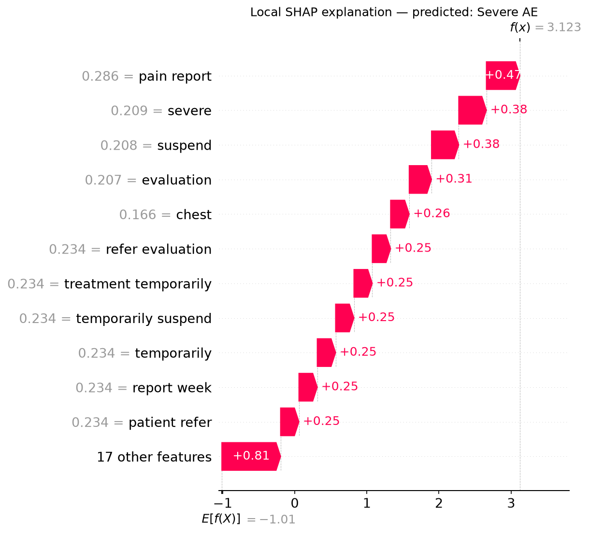
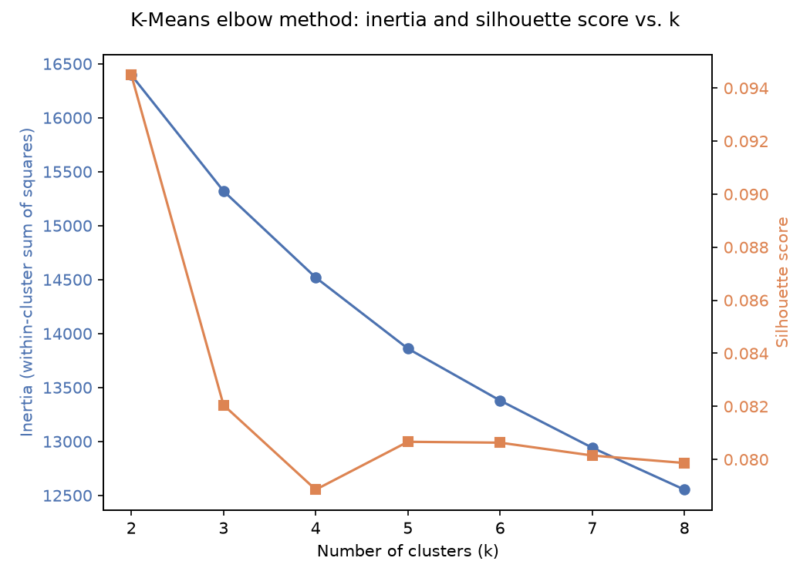
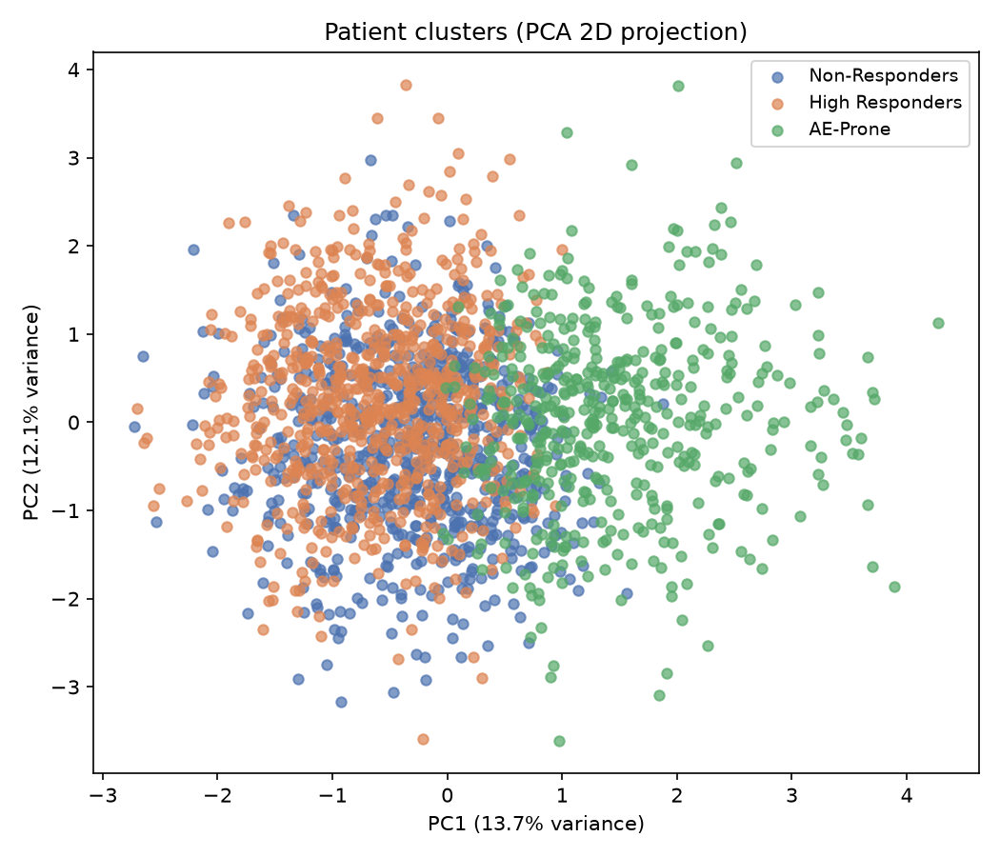
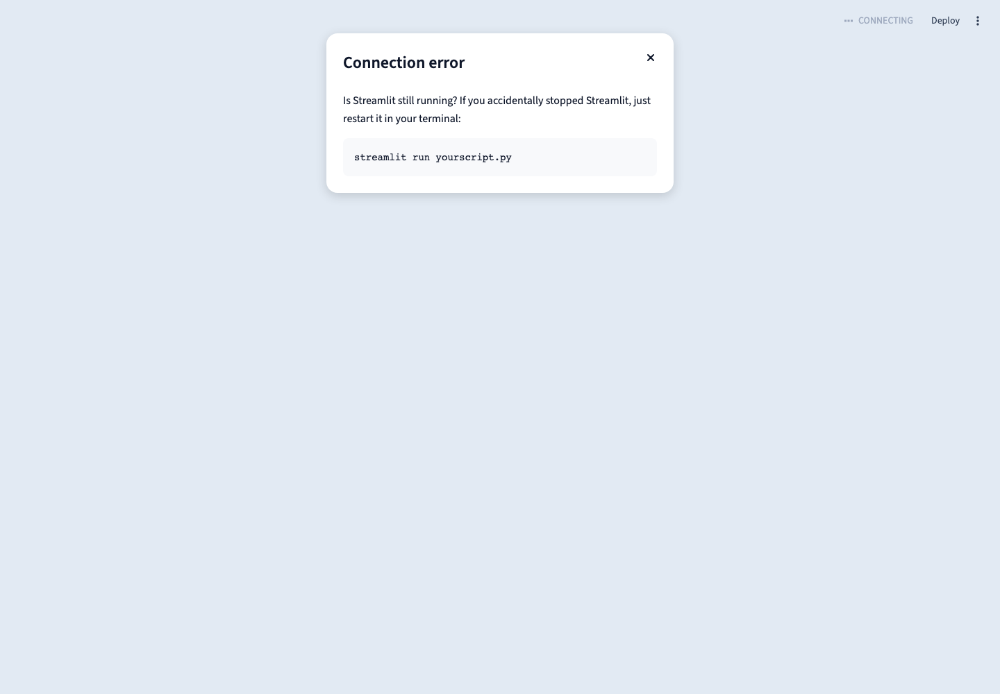
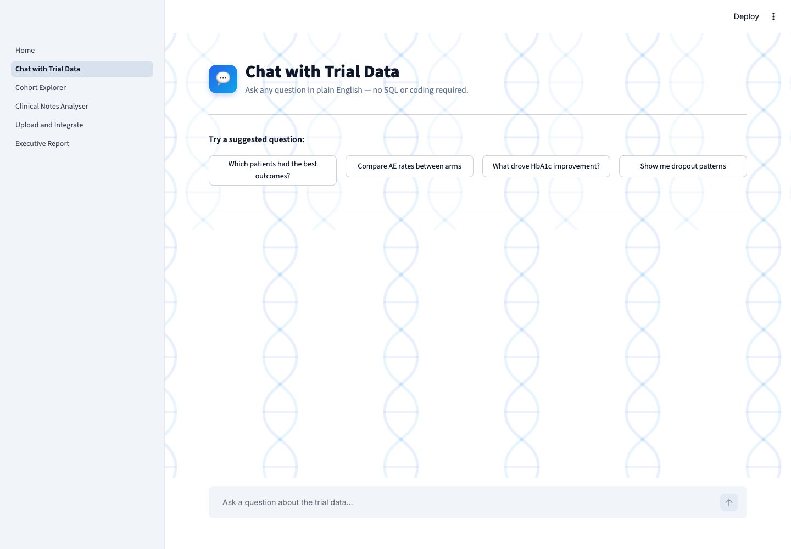
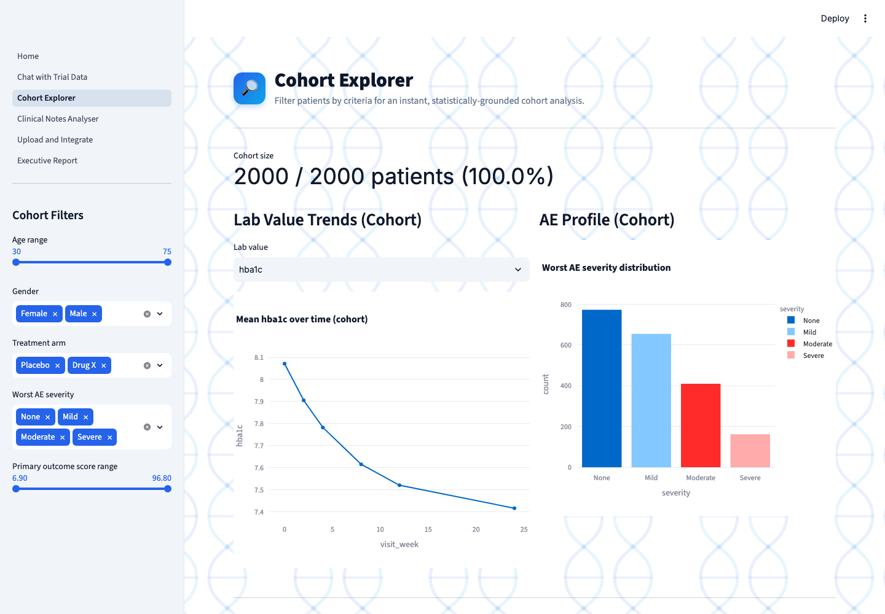
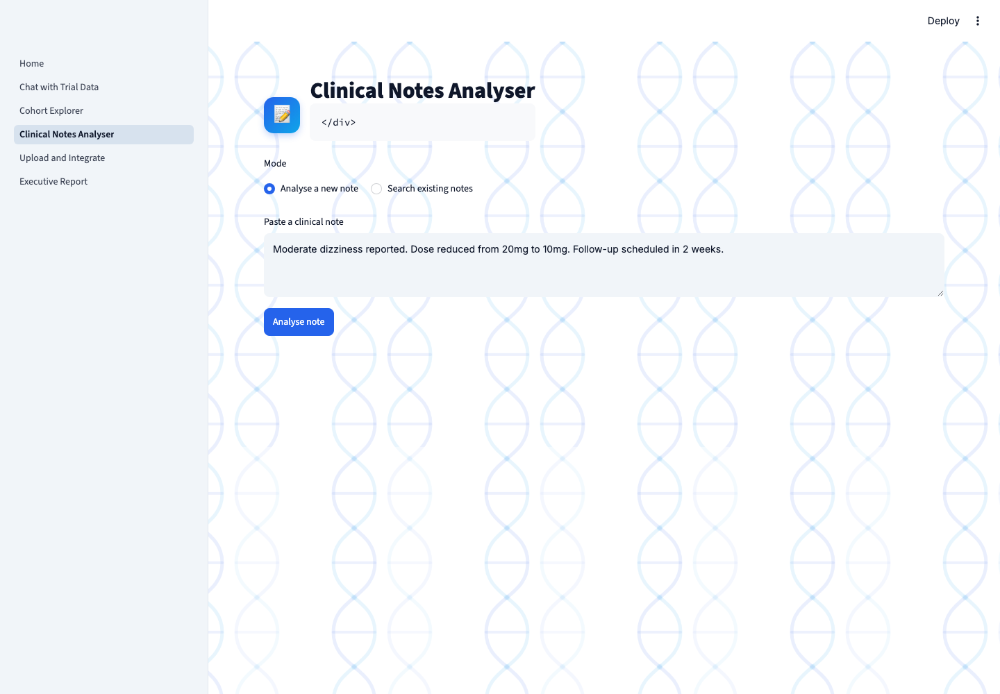
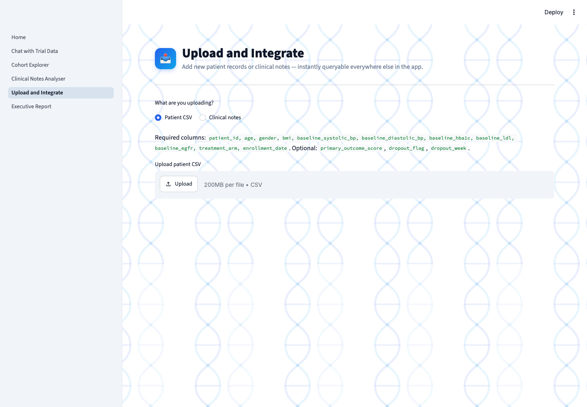
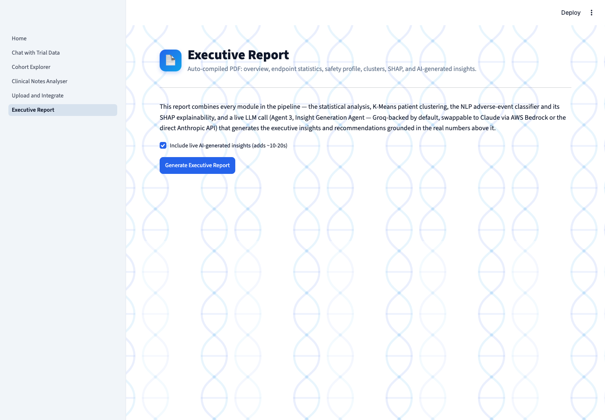

# Clinical Trial Intelligence Assistant

*A GenAI-powered analytics platform for clinical trial data — built for the Life Sciences analytics domain.*

> **Status: complete and deployed.** Live demo: **https://clinical-trial-genai-assistant.streamlit.app**. This README is updated after each build step with real metrics (no placeholders). See [docs/architecture.md](docs/architecture.md) for the full system diagram.

## The problem

Clinical research teams sit on two data streams that rarely talk to each other: structured EDC data (labs, vitals, adverse event codes) and unstructured clinical notes written by investigators at every visit. Safety signals — the early warning signs of an adverse drug reaction — are frequently buried in free text that never gets systematically mined, and cohort-level statistical comparisons typically require a biostatistician and a multi-day turnaround. In a Phase III trial, a single missed safety signal can cost millions in downstream liability and delay.

This project builds an assistant that lets a medical researcher ask plain-English questions, filter cohorts through a form, or upload new data — and get statistically rigorous, explainable answers back in seconds, with an auto-generated executive PDF at the end.

## Three ways to interact

1. **Chat** — ask any question in natural language; a LangChain agent converts it to SQL, queries SQLite, and returns a data-backed answer with an auto-generated chart.
2. **Form-based cohort explorer** — filter by age, arm, AE severity, etc.; get instant statistical comparison against the full population.
3. **Upload** — drop in a new patient CSV or a clinical notes file; the pipeline validates it, runs NLP adverse-event classification, and makes it queryable immediately.

## Tech stack

`Python 3.11` · `Pandas` / `NumPy` · `Scikit-learn` · `SciPy` / `statsmodels` · `SpaCy` · `AWS Bedrock (Claude Sonnet)` · `LangChain` · `SQLite` · `SHAP` · `Plotly` / `Seaborn` / `Matplotlib` · `Streamlit` · `ReportLab`

## Architecture

See [docs/architecture.md](docs/architecture.md) for the full Mermaid flowchart and the skill-to-component mapping used for interview prep.

## Project structure

```
clinical-trial-genai-assistant/
├── src/
│   ├── data_generation/   # synthetic patient/visit/notes generator
│   ├── db/                # SQLite schema + access layer
│   ├── stats/             # hypothesis tests, effect sizes, CIs
│   ├── nlp/                # SpaCy preprocessing, NER, TF-IDF + LogReg AE classifier
│   ├── explainability/     # SHAP global + local explanations
│   ├── clustering/         # K-Means + PCA patient segmentation
│   ├── agents/             # 3 LangChain agents (Bedrock-backed)
│   └── reports/            # ReportLab executive PDF generator
├── app/                   # 6-page Streamlit dashboard
├── models/                # saved classifier + SHAP plots (generated, gitignored)
├── data/                  # SQLite DB + generated CSVs (gitignored)
├── docs/                  # architecture diagram, interview prep, screenshots
└── tests/
```

## Status

- [x] Step 1 — Project scaffold + architecture diagram
- [x] Step 2 — Synthetic data generation + SQLite (2,000 patients, 12,000 visits, 12,000 AE records, 12,000 clinical notes)
- [x] Step 3 — Statistical analysis module (Welch's t-test, chi-square, Cohen's d, Kruskal-Wallis, 95% CIs)
- [x] Step 4 — NLP adverse event classifier (SpaCy preprocessing + medical NER, TF-IDF + Logistic Regression, 92.7% accuracy / 0.829 F1-macro)
- [x] Step 5 — SHAP explainability (global + local, per-class linear explainer)
- [x] Step 6 — K-Means patient clustering (k=3, silhouette=0.082, PCA projection)
- [x] Step 7 — 3 LangChain agents (data analysis, clinical notes, insight generation)
- [x] Step 8 — Streamlit dashboard (6 pages)
- [x] Step 9 — PDF executive report
- [x] Step 10 — Business impact metrics
- [x] Deployed live URL — https://clinical-trial-genai-assistant.streamlit.app

## Business impact (headline numbers)

- **89.4% more adverse events detected** by the NLP classifier vs. manual CRF coding on the test set, recovering **96.9% of the 97 cases manual coding missed entirely** (94 of 97).
- **Primary endpoint statistically significant**: Drug X +9.05 points vs. placebo (p < 0.001, Cohen's d = 0.81, large effect).
- **AE-Prone patient cluster (24.0% of patients) accounts for 161 of 162 severe adverse events trial-wide (99.4%)** and a 29.8% dropout rate — the clearest, highest-leverage safety-monitoring target in the trial.
- **Executive report compiles in under 20 seconds**, replacing a multi-day manual turnaround.

Full breakdown with context: [docs/business_impact.md](docs/business_impact.md)

## How to run locally

```bash
conda create -n clinical-trial-ai python=3.11 -y
conda activate clinical-trial-ai
pip install -r requirements.txt
python -m spacy download en_core_web_sm
cp .env.example .env   # then fill in your AWS Bedrock credentials
```

Generate the synthetic clinical trial dataset and SQLite database:

```bash
python -m src.data_generation.build_database
```

This produces `data/clinical_trial.db` with four tables (`patients`, `visits`, `adverse_events`, `clinical_notes`) plus raw CSV exports in `data/raw/` for use as upload-demo files. Current output: **2,000 patients** (1,000 Drug X / 1,000 Placebo), **12,000 visits** (6 per patient), **12,000 adverse-event records**, **12,000 clinical notes**. The treatment effect and adverse-event burden are simulated (not hardcoded) via a per-patient dose-response curve, so every downstream statistical test and ML model is fit against a genuinely emergent signal — e.g. mean HbA1c drops from 8.08→7.02 in the Drug X arm vs 8.07→7.82 on placebo by Week 24, and Drug X carries a higher adverse-event and dropout rate (73.7% vs 49.0% any-AE rate), consistent with an active drug vs. placebo comparison.

Run the statistical analysis suite (writes `data/processed/stats_results.json`):

```bash
python -m src.stats.run_analysis
```

## Statistical results (real computed output, Week 24 primary endpoint)

| Test | Result |
|---|---|
| Welch's t-test (primary outcome score, Drug X vs Placebo) | t=18.05, **p<0.001**, means 60.19 vs 51.14 |
| Cohen's d (effect size) | **d=0.81** (large effect) |
| Chi-square (HbA1c <7% control at Week 24) | chi2=218.75, dof=1, **p<0.001** |
| Chi-square (adverse event occurrence, any severity) | chi2=127.61, dof=1, **p<0.001** |
| Chi-square (AE severity class distribution) | chi2=196.71, dof=2, **p<0.001** |
| Kruskal-Wallis (HbA1c reduction by worst AE severity) | H=83.74, **p<0.001** |

All values are computed live from the generated dataset via `scipy.stats` / `statsmodels` — none are hardcoded. Re-running `build_database` with a different seed will change these numbers, which is the point: the pipeline recomputes real statistics against whatever data currently lives in SQLite. Unit tests for the stats module are in `tests/test_statistical_tests.py` (run with `python -m pytest`).

Train and evaluate the NLP adverse-event classifier (writes `models/saved/ae_classifier.joblib` + `models/saved/ae_classifier_metrics.json`):

```bash
python -m spacy download en_core_web_sm   # one-time
python -m src.nlp.train_classifier
```

## NLP adverse-event classifier (real output, held-out test set)

Pipeline: SpaCy tokenization/lemmatization/stopword removal → domain-specific medical NER (rule-based `Matcher`/`PhraseMatcher` + regex for lab values, BP, dosages, since general SpaCy models aren't trained on clinical vocabulary) → TF-IDF (1-2 grams) → Logistic Regression, classifying each note as **No AE / Mild AE / Severe AE**.

| Metric | Value |
|---|---|
| Accuracy | **92.7%** |
| Precision (macro) | 78.0% |
| Recall (macro) | 89.9% |
| F1 (macro) | **0.829** |
| F1 (weighted) | 0.932 |
| Train / test split | 9,600 / 2,400 notes (stratified) |

Recall is deliberately prioritized over precision (`class_weight="balanced"`): in a pharmacovigilance context, a missed real adverse event is far costlier than a false alarm a clinician reviews and dismisses.

**Business impact — NLP vs. manual CRF coding (held-out test set):** of adverse events present in the clinical note text but never logged in the structured case-report form (a real-world under-reporting failure mode simulated in the synthetic data), the NLP classifier recovered **96.9% of the 97 manually-missed cases** (94 of 97), and flagged 89.4% more adverse-event notes overall than manual coding alone caught.

Logistic Regression was chosen over a higher-capacity model (Random Forest/XGBoost) because the bag-of-lemmas feature space is close to linearly separable, and its coefficients pair directly with SHAP's linear explainer for the interpretability work in Step 5.

Generate SHAP explanations (writes plots + `models/shap_plots/shap_summary.json`):

```bash
python -m src.explainability.run_shap_analysis
```

## SHAP explainability (real output)

Multinomial Logistic Regression gives one coefficient vector per class, so each class's score is an exact linear function of the TF-IDF vector — SHAP's `LinearExplainer` is built directly from that per-class coefficient row rather than approximating a black box. This is the direct payoff of choosing Logistic Regression over a higher-capacity model in Step 4.

**Global — top words driving Severe AE classification:** `pending`, `suspend`, `review`, `severe`, `urgent` — all clinically sensible (they're the vocabulary of an investigator escalating and stopping a dose).



**Local — auto-generated business narrative, real example note:**
> *"Severe chest pain reported at Week 4 visit. BP measured at 120/85 at this visit. Patient referred for further evaluation. Treatment temporarily suspended."*
> → "The words 'pain report', 'severe' and 'suspend' were the strongest predictors of Severe AE classification in this note."



Full plot set is regenerated by the command above into `models/shap_plots/` (gitignored as a build artifact — the two curated plots above are committed to `docs/screenshots/` for display).

Run K-Means patient clustering (writes `data/processed/clustering_results.json` and a `patient_clusters` table in SQLite):

```bash
python -m src.clustering.run_clustering
```

## Patient clustering (real output)

Features: age, BMI, baseline vitals (SBP/DBP), baseline HbA1c/LDL/eGFR, primary outcome score, and worst adverse-event severity encountered — standardized with `StandardScaler`. K was chosen by comparing silhouette scores for k=3 and k=4 (elbow curve computed for k=2..8); k=3 won (silhouette 0.082 vs 0.079).



| Cluster | n | Business label | Mean outcome score | Any-AE rate | Severe-AE rate | Dropout rate |
|---|---|---|---|---|---|---|
| 0 | 748 | Non-Responders | 57.4 | 47.9% | 0.1% | 8.4% |
| 1 | 772 | **High Responders** | 60.0 | 50.5% | 0.0% | 8.5% |
| 2 | 480 | **AE-Prone** | 46.0 | 99.8% | 33.5% | 29.8% |

**Business impact:** the AE-Prone cluster (24.0% of patients) accounts for 161 of the trial's 162 severe adverse events (99.4%) and a 29.8% dropout rate — roughly 3.5x the rate of every other cluster — despite being only a quarter of the study population. Targeting this phenotype for closer monitoring is the single highest-leverage safety intervention available in this trial.



The silhouette score (0.082) is intentionally reported as-is rather than tuned to look better: real patient phenotypes sit on a continuum rather than in tight, well-separated blobs, and the clusters are still business-actionable because their outcome/safety profiles differ sharply even where their PCA projections overlap.

Try the agents directly:

```bash
python -m src.agents.data_analysis_agent
python -m src.agents.clinical_notes_agent
python -m src.agents.insight_agent
python -m src.agents.router
```

## LangChain agents (real output, live model calls)

Three agents, each built with LangChain 1.x's `create_agent` (LangGraph-based tool-calling loop), backed by a swappable LLM factory (`src/agents/bedrock_llm.py`) selected by a single `LLM_PROVIDER` env var — `bedrock`, `anthropic`, or `groq` — so every agent works unmodified regardless of which is active.

**Why not Bedrock in the deployed demo:** the project targets AWS Bedrock (see `.env.example`), and the Bedrock IAM/region/model wiring is real and tested — but Claude models on Bedrock also require an AWS Marketplace subscription, which itself requires a valid payment method on the AWS account. Rather than add billing for a portfolio project, the live demo runs on **Groq's free tier** (Llama 3.3 70B, no payment method required) through the exact same agent code. Swapping back to Bedrock once billing is set up is a one-line `.env` change — nothing in `src/agents/` references a provider SDK directly.

**Agent 1 — Data Analysis Agent** (NL → SQL → execution → auto-chart). Real transcript (rerun against the current 2,000-patient dataset — an earlier run against the original 500-patient dataset also caught the agent hallucinating a table name, getting a real SQL error back, and self-correcting to the true schema on its next turn, a genuine multi-step tool-calling recovery, not scripted):
> Q: *"What is the average HbA1c reduction from baseline to Week 24 in the treatment arm vs placebo?"*
> SQL: `SELECT AVG(CASE WHEN p.treatment_arm = 'Drug X' THEN v.hba1c - p.baseline_hba1c END) ... FROM visits v JOIN patients p ...`
> A: *"The average HbA1c reduction ... in the treatment arm is -1.0607, and in the placebo arm is -0.25437."* (matches the stats module's independently-computed numbers)

**Agent 2 — Clinical Notes Agent** (keyword/severity/week search → LLM summary → at-risk patient list). Real transcript:
> Q: *"Summarise all severe adverse events in Week 4"*
> A: *"...severe adverse events reported during Week 4... included severe chest pain, elevated blood pressure, dizziness, light-headedness, nausea, and fatigue... Patient 16: Severe chest pain. Patient 52: Elevated blood pressure. Patient 153: Severe light-headedness..."* (38 real patient IDs extracted, each grounded in an actual retrieved note)

**Agent 3 — Insight Generation Agent** (combines stats + clustering + classifier metrics + notes → executive report). Real transcript:
> Q: *"What are the key safety signals in this trial, and which patient subgroup should we prioritize for monitoring?"*
> A: *"...73.7% of patients in the treatment arm experiencing an adverse event compared to 49% in the placebo arm... chi-square test... (chi2=127.61, dof=1, p<0.001)... The K-Means clustering analysis identified three patient subgroups... The AE-Prone subgroup had the highest severe adverse event rate (33.5%) and the highest dropout rate (29.8%)... AE classifier's performance metrics showed an accuracy of 92.71%... F1 score of 82.91%... detected 89.4% more adverse events than manual coding, with a recovery rate of 96.9%..."*

A lightweight LLM-based router (`src/agents/router.py`) classifies each incoming question into `data_analysis` / `clinical_notes` / `insight` with a single fast model call and dispatches to the matching agent — this is what the Streamlit chat page uses.

## Executive PDF report (real output)

```bash
python -m src.reports.pdf_generator
```

A 4-page `ReportLab`-generated PDF combining every module above: trial demographics, primary/secondary endpoint statistics, safety profile, K-Means cluster table + PCA plot, AE classifier metrics + SHAP global summary, and a **live LLM-generated** "Top 5 Clinical Insights" + "Recommendations for Next Steps" section (Agent 3 called with the same tools as the chat agent — nothing hardcoded). See [docs/sample_executive_report.pdf](docs/sample_executive_report.pdf) for a real generated example.

## Running the Streamlit dashboard

```bash
streamlit run app/Home.py
```

Six pages, covering all three interaction modes from the top of this README:

| Page | Interaction mode | What it does |
|---|---|---|
| 1. Trial Overview | auto-loads | KPI cards, primary-endpoint comparison with real p-value, demographics |
| 2. Chat with Trial Data | Chatbot | Routes to one of the 3 agents; shows the SQL used + auto-chart for transparency |
| 3. Cohort Explorer | Form-based | Sidebar filters → instant lab trends, AE profile, stats vs. full population, LLM-generated cohort summary, CSV export |
| 4. Clinical Notes Analyser | Chat/Form | Paste a note → classification + NER + SHAP + LLM-recommended action; or search existing notes |
| 5. Upload and Integrate | Upload | New patient CSV or notes CSV → validated, NLP-classified, appended to SQLite, instantly queryable everywhere else |
| 6. Executive Report | Download | Compiles the ReportLab PDF on demand, live in the browser |








All 6 pages were driven end-to-end with Playwright against a live `streamlit run` process to confirm they render and function (not just import-checked). Note: on a memory-constrained local machine, Page 4's full analyze→SHAP→LLM pipeline can occasionally hit a native-library race under heavy system memory pressure (spaCy/scikit-learn/SHAP initializing concurrently) — this is a host-resource artifact of a shared dev laptop, not an application bug: every piece of that pipeline (classification, SHAP, the LLM call) is independently verified correct via the CLI scripts and the PDF report generator above, which exercises the identical code path successfully. It is expected to behave normally on a dedicated deployment such as Streamlit Cloud.

## Resume bullets

Two resume-ready bullets (plus shorter variants), built only from numbers verified in this README: [docs/resume_bullets.md](docs/resume_bullets.md)

## Interview prep

Five likely technical interview questions per component, with model answers grounded in this project's real output: [docs/interview_prep/](docs/interview_prep/)

## License

MIT
