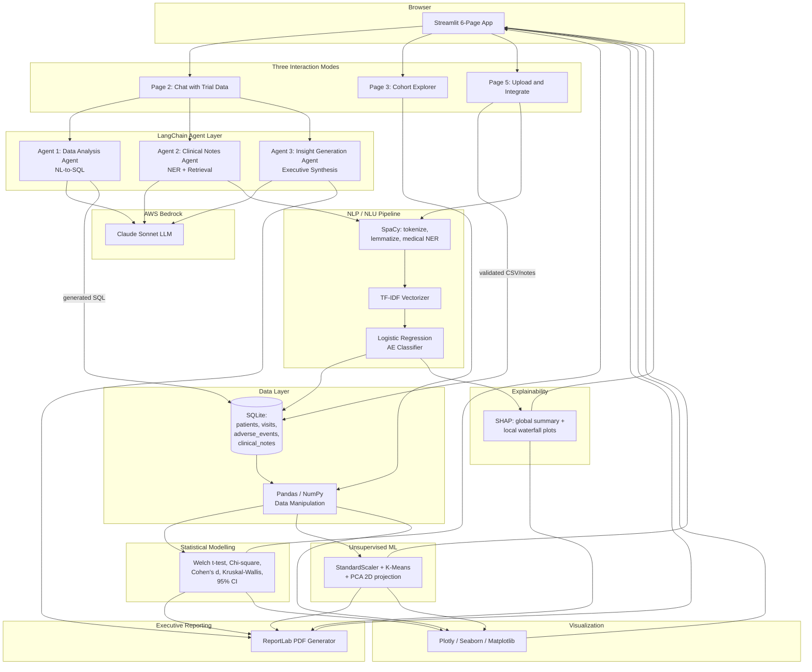

# Architecture

## Data flow summary

1. **Browser → Streamlit → LangChain agents → AWS Bedrock**: natural-language questions are routed to one of three agents, which call Claude Sonnet on Bedrock for reasoning/summarization/generation.
2. **Browser → SpaCy NLP → Scikit-learn classifier → SHAP**: clinical notes (typed, searched, or uploaded) are preprocessed, classified for adverse-event severity, and explained token-by-token.
3. **Browser → SQLite → Pandas → Statistical tests → Plotly**: structured cohort queries pull from SQLite, get manipulated in Pandas, are tested for significance, and rendered as charts.

## Component-to-Tredence-skill mapping

| Component | Skill demonstrated |
|---|---|
| Data generation, cohort filtering | Pandas, NumPy |
| AE classifier, K-Means clustering | Scikit-learn (classification + clustering) |
| Welch's t-test, chi-square, Cohen's d, Kruskal-Wallis | Statistical modelling / hypothesis testing |
| SpaCy NER, TF-IDF | NLP / NLU |
| 3 LangChain agents + AWS Bedrock | GenAI, agent-based systems |
| SHAP global/local plots | Interpretable models |
| SQLite schema + aggregation queries | Advanced SQL |
| Plotly/Seaborn/Matplotlib dashboards | Data visualization |
| Business impact metrics throughout | Business audience framing |
